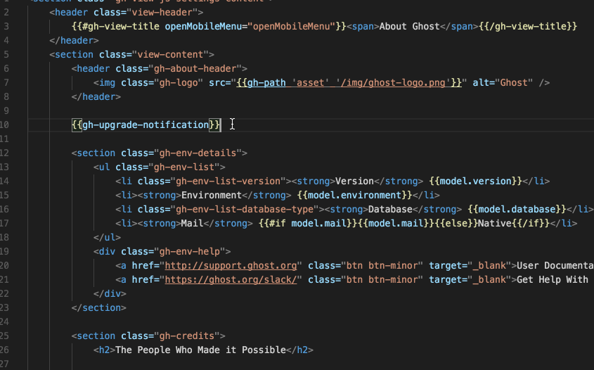

# vscode-ember

This is the VSCode extension to use the [Stable Ember Language Server](https://github.com/lifeart/ember-language-server).

`Stable Ember Language Server` is full-featured fork of [Ember Language Server](https://github.com/ember-tooling/ember-language-server). It's `stable` and `extremely` power-featured.

All `Ember Language Server` features included.



## Best with

- [Glimmer Templates Syntax for VS Code](https://marketplace.visualstudio.com/items?itemName=lifeart.vscode-glimmer-syntax)
- [Prettier](https://marketplace.visualstudio.com/items?itemName=esbenp.prettier-vscode)

## Features

- Autocomplete (including installed addons and in-repo addons)

  - Components (Curly, Angle Bracket)
  - Component Arguments (if used in template)
  - Service names
  - Route/Controller transition functions route names
  - Model names (store methods, model relation definition)
  - Transform names (model definition)
  - Helpers
  - Modifiers
  - Get / Set / ... / Computed macros
  - Local paths in templates (`this...`)
  - Route autocompletion in `link-to`
  - `<LinkTo />` @route argument autocomplete

- Definition providers for (enable features like "Go To Definition" or "Peek Definition"):

  - Components (in Templates)
  - Outlets
  - Helpers (in Templates)
  - Modfiers
  - Models
  - Transforms
  - Routes
  - Services
  - Ember-addons imports
  - Component block arguments (`as | name | `)
  - Any local paths (`this...`)

- Lense provider

  - Related Files (tests, styles, templates, etc)

- Folding ranges provider

  - Foldings provided for handlebars syntax in `hbs`, `js`, `ts`, `gts`, `gjs` files.

- Component usages

  - Route Templates
  - Component Templates

- ember-template-lint Diagnostics integration (if it is included in a project)

  - Template parsing issues
  - Template linting
  - Template linting inside tests
  - Auto-fix action for fixable linting issues

- Supported layouts

  - Classic
  - Template Collocation
  - Pods

- Supported Script Files
  - JavaScript
  - TypeScript

## Available addons

Using this addons as dev-dependencies in your project (or downloading and providing path in extension configuration - "els.local.addons") may extend LS functionality or override default one.

- [els-addon-glint](https://github.com/lifeart/els-addon-glint) - Glint integration for LS.
- [els-a11y-addon](https://github.com/lifeart/els-a11y-addon) - Ember Language Server a11y addon.
- [els-addon-typed-templates](https://github.com/lifeart/els-addon-typed-templates) - Typed Templates for Ember.
- [els-addon-docs](https://github.com/lifeart/els-addon-docs) - Ember Language Server Addon Docs Completion Provider.
- [ember-fast-cli](https://github.com/lifeart/ember-fast-cli) - Addon for Ember-cli commands execution.
- [els-intl-addon](https://github.com/lifeart/els-intl-addon) - Internationalization addon for Stable Ember Language Server.
- [els-component-extraction-addon](https://github.com/lifeart/els-component-extraction-addon) - Create components from selection, using `ember-fast-cli`.
- [els-addon-file-watcher](https://github.com/lifeart/els-addon-file-watcher) - Project change detection addon (not needed for VSCode users)

## Settings

- `els.server.debug.port` - LS debug port
- `els.server.debug.enabled` - disable / enable LS debug
- `els.codeLens.relatedFiles` - disable / enable related files
- `els.local.useBuiltinLinting` - disable / enable ember-template-lint integration
- `els.local.useBuiltinFoldingRangeProvider` - disable / enable folding range provider (hbs)
- `els.local.addons` - globally defined local language server addons entry folders, for example:

```js
{
    "els.local.addons": ["C:\\Users\\ember\\els-addon-typed-templates"],
}

```

- `els.local.ignoredProjects` - Supports Ignoring of LS initialization on unneeded projects, for example, the below setting will ignore the initialization of the project named, `sample-project-name`:

```js
{
    "els.local.ignoredProjects": ["sample-project-name"],
}

```

_Note: `ignoredProjects` leverages the projectName from the `name` property of the project's `package.json`_

## Debugging

See [debugging page](DEBUGGING.md)
